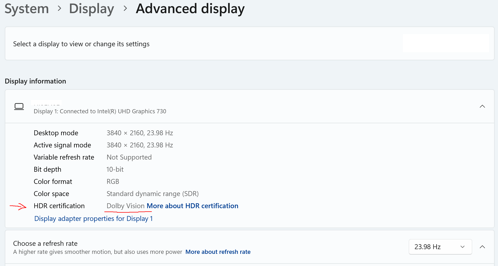

# dovi-jellyfin

Dolby Vision playback for a Jellyfin HTPC on **Windows 11** -- no dedicated DV player app:
**Microsoft Edge + stock jellyfin-web + the Windows Dolby Vision extension**, so the whole
Jellyfin front-end (library, watched states, Next Up, remote control) keeps working.

> Unofficial community project -- not affiliated with Jellyfin, Dolby, or Microsoft.
> Nothing in Jellyfin is patched: this is a launcher + userscript around the stock web client.

Clone or unzip the repo and run **`setup.cmd`** (double-click works). Tested stack: **Windows 11 25H2
(build 26200) + Edge + Jellyfin 10.11.x** -- other builds likely work but are untested.

## Check this BEFORE buying the HEVC extension

**Settings > System > Display > Advanced display** must show
**`HDR certification: Dolby Vision`**:

Very few displays/TVs get this line out of the box -- **expect it to be missing** and plan
for the EDID fix below. Without it the DV decoder will never engage and nothing in this
repo can help -- **do not buy the paid HEVC Video Extensions yet.** `setup.cmd` checks
this first.

### Certification line missing? Fix the EDID first

Most TVs don't advertise DV on the HDMI input a PC uses, so a missing line is the NORMAL
starting state -- and an EDID override is the ONLY way to get it. Follow
**[dolby-vision-for-windows](https://github.com/balu100/dolby-vision-for-windows)
step by step** (CRU + a one-byte edit of the Dolby VSVDB block). Its README has known
per-TV values (e.g. Hisense U8GQ: `480362746a7f7c` -> `480363746a7f7c`) and a calculator
for everything else. Reboot, confirm the settings page now shows the line, then come back
here -- **nothing below works until it does.**

## What you get

| | |
|---|---|
| DV profiles 5 + 8 | Direct-play with the DV dynamic metadata applied. The PC does the DV processing itself (LLDV-style) and outputs HDR10 -- so the TV never shows its DV logo; that is normal for this setup. |
| Profile 7 (FEL) | Plays as base layer + dynamic metadata; the FEL enhancement layer is ignored |
| Audio | AAC / AC3 / EAC3 / FLAC / 2ch-Opus direct-play; DTS / TrueHD / >2ch-Opus auto-transcode (video stays copied) |
| Display switching | Optional gate service flips desktop HDR + matches refresh rate BEFORE the first frame |
| Bonus (unverified) | Direct-played EAC3 Atmos can reach "Dolby Atmos for Headphones" still encoded = true object-based HRTF (needs Dolby Access) |

## Requirements

- Windows 11 (tested 25H2 / 26200), a DV-capable TV, and the certification line above.
- Microsoft Edge + ViolentMonkey (MV2 extension -- the setup script pins the Edge MV2 policy;
  Tampermonkey MV3 is the fallback if Edge ever drops MV2).
- **Dolby Vision Extensions** (free) + **[HEVC Video Extensions](https://apps.microsoft.com/detail/9nmzlz57r3t7)**
  (paid, ~1 USD/EUR).
- A Jellyfin server reached directly by host/IP + port (`http://htpc:8096/...`) -- the
  normal LAN setup. A reverse proxy that serves Jellyfin under a subpath
  (`https://mydomain/jellyfin/...`) breaks the userscript.
- Only for the optional gate: PowerShell 7 + the DisplayConfig module (setup installs both).

## Setup

1. Run `setup.cmd` (interactive, buys nothing, checks the DV line first).
2. ViolentMonkey: toolbar icon -> **Open dashboard**, drag `required/jellyfin-dv.user.js`
   onto it -> **Confirm installation**. Verify: reload the Jellyfin tab (**F5**) -> the VM
   icon shows a **"1" badge**. No badge -> edit the script's `@match` lines to your URL.
3. Edit `required/jellyfin-edge-dv.cmd`: the Jellyfin URL at the bottom (and the Edge
   executable path if yours is not the default install).
4. Edge (`edge://settings/system`): disable **Startup boost** and **background apps** --
   a leftover Edge process silently eats the DV flags.
5. GPU control panel: output = **RGB, 10-bit, FULL range**; TV input on Enhanced/full black
   level. YCbCr or limited range = crushed/washed blacks in this windowed path -- the
   OPPOSITE of the classic fullscreen-HTPC advice. (On HDMI 2.0 this caps 4K at 30 Hz;
   film rates are fine.)
6. Apply the **Jellyfin settings** below -- on the FINAL URL. jellyfin-web stores settings
   per origin: `192.168.1.x:8096` and `htpc:8096` are two different players. Pick one URL
   and use it in the launcher, the userscript, and your settings.
7. **Always start Edge via `required/jellyfin-edge-dv.cmd`** -- an Edge you start
   manually (taskbar/Start menu) has no DV flags and DV silently won't engage. The setup
   offers a "Jellyfin DV" desktop shortcut for it.

<b>Optional: automatic HDR + refresh switching (gate service) -- click to expand</b>

- The launcher auto-starts it (`GATE_ARGS` in the `.cmd` for options); logs to
  `jf-hdr-gate.log` next to the script.
- Parameters at the top of `optional/jf-hdr-gate.ps1`: `DisplayId` (find yours:
  `pwsh -Command Get-DisplayInfo`), `DefaultHz` (idle rate), `ReachableHz` (4K rates your
  display reaches), `SettleMs` (raise if your TV re-syncs slowly).
- Modes: `-RefreshOnly` (never touch HDR), `-DefaultHdr` (baseline = HDR on),
  `-AllowedOrigins` (restrict browser-origin requests to your Jellyfin origin on a
  non-dedicated PC; local tools like curl stay allowed).
- Known-good reset: `curl -X POST http://127.0.0.1:17999/default` -- also runs
  automatically at every service start.
- First run: confirm `http://127.0.0.1:17999/health` answers. If the listener can't bind,
  run the `netsh http add urlacl` line from setup step 5. Must run in the interactive
  desktop session (not via SSH/RDP-disconnected).
- Every real mode switch costs one TV re-sync blank (~2-3 s); same-mode binge = instant.
- Without the gate DV still works: toggle HDR yourself BEFORE pressing play --
  `Win+Alt+B` (a Game Bar shortcut; present on stock Win11, gone if you uninstalled
  Game Bar -> use Settings > Display > HDR instead).

## Jellyfin settings

User settings (per-origin -- set them on the final URL):

| Where | Setting | Value |
|---|---|---|
| Playback > Advanced | Prefer fMP4-HLS Media Container | **enable** |
| Playback > Video Advanced | Enable DTS (DCA) | **off** |
| Playback > Video Advanced | Enable TrueHD | **off** |
| Subtitles | Burn subtitles | **Auto** |
| Subtitles | Experimental PGS subtitle rendering | **on** |

fMP4 lets FLAC/Opus tracks copy losslessly instead of transcoding to AAC; DTS/TrueHD off
makes Jellyfin transcode what Edge cannot decode; PGS-rendering avoids burn-in transcodes.

Server settings (Dashboard > Playback > Transcoding):

| Setting | Value |
|---|---|
| Throttle Transcodes | **off** |
| Delete segments | **off** |

Throttling stalls Edge's HLS on seek/resume; deleting segments forces re-transcodes on
seek-back.

## Audio tracks -- what actually happens

Edge plays only the FIRST audio track of a direct-played MKV and cannot switch in-player.
Selecting another track still works: Jellyfin re-serves it as a **lossless copy remux**
(no re-encode). Only DTS/TrueHD/>2ch-Opus selections trigger a real audio transcode --
and the video stays copied either way.

## Verify DV works

- **The "Dolby Vision" popup** appears top-right at playback start = pipeline is live.
  No popup on a DV title = it is playing as plain HDR10.
- Trim response: play an `L2 trims` / Eagle-beak clip from RESET_9999's
  [DV RPU METADATA RESPONSE folder](https://drive.google.com/drive/folders/1nMz95KqgkO95EDGrYhrk-Ifx6vRYDEfs)
  -- brightness (watch the yellow beak) visibly shifts as the trims hit; static without DV.
  More DV-vs-HDR10 pairs: [full pattern collection](https://drive.google.com/drive/folders/1yAq-jgsb8pYa92PnGZkxyEV0E3VVkhiC).
- Game Bar `Win+Alt+B` toggles HDR mid-play: DV drops and re-engages (popup reappears).

## Common problems

| Symptom | Check |
|---|---|
| No DV popup | Certification line; HDR on; `edge://version` shows the `--enable-features` list (startup boost eats it) |
| DV title transcodes | VM badge on the tab; `VideoRangeTypeNotSupported` in `optional/jf_sessions.py` output = userscript not active on this URL |
| Gate dead / delayed play start | `127.0.0.1:17999/health`, `jf-hdr-gate.log`, the `netsh urlacl` step; newer Edge may show a "local network access" permission prompt for the page -> allow it |
| No/wrong refresh switch | `ReachableHz` vs what the driver actually offers at 4K |
| Crushed or washed blacks | RGB Full 10-bit + TV black level (Setup step 5) |

## Known limits (the dealbreakers)

- No FEL decode; no TV-led DV in this setup.
- No DTS/TrueHD bitstreaming; those tracks transcode.
- The launcher kills ALL Edge processes (a dedicated HTPC is assumed).
- No 4K50/60 HDR on HDMI 2.0 GPUs in this path.
- Edge updates can move the ground (DV feature flags, MV2); re-verify after major updates.

## Files

| Path | What |
|---|---|
| `setup.cmd` / `setup.ps1` | Guided prerequisite installer (DV check first, buys nothing) |
| `required/jellyfin-dv.user.js` | The DV userscript (direct-play + display preflight) |
| `required/jellyfin-edge-dv.cmd` | Flag-Edge launcher (auto-starts the gate if present) |
| `optional/jf-hdr-gate.ps1` | HDR + refresh gate service (127.0.0.1:17999) |
| `optional/jellyfin-menu.user.js` | Context-menu additions (Reset resume, Mark Watched/Unplayed) + mpv-style hotkeys + extra gamepad keys (see `docs/hotkeys.md`) |
| `optional/jf_sessions.py` | "Why is this transcoding?" diagnostic |
| `docs/hotkeys.md` | Stock jellyfin-web hotkeys + TV layout / gamepad settings |

## Credits

[balu100/dolby-vision-for-windows](https://github.com/balu100/dolby-vision-for-windows)
(the EDID groundwork) / [MartinGC94/DisplayConfig](https://www.powershellgallery.com/packages/DisplayConfig)
(the gate's display module) / RESET_9999 aka The HDR Dissector (test patterns).
MIT license.
